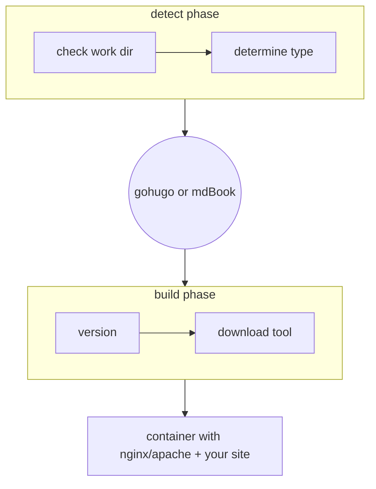

# static-buildpack

A buildpack static websites, aka for:

* gohugo
* mdBook

---

Here's a high-level overview about how this works:

Some configuration is available, please see [api](./api/) for details.

## Dependencies

- `paketo-buildpacks/nginx`
- `paketo-buildpacks/httpd`
- `paketo-buildpacks/node-engine`
- `paketo-buildpacks/npm-install`
- `paketo-buildpacks/node-run-script`

Either of these can be customized through various environment variables or a full config file for the web server. More details are available [on our documentation](https://www.runway.horse/docs/recipes/webservers/).

### NodeJS

If your static website requires npm (for css/assets), then a `package.json` with a `build` task (`npm run build`) in the root of the repository (or the value of `BP_NODE_RUN_SCRIPTS`) will suffice to include it in the buildplan.

> [!IMPORTANT]
> Please set `BP_KEEP_FILES` accordingly to keep the generated assets in the container. More details are available on [our documentation](https://www.runway.horse/docs/recipes/javascript/).

## Usage / License

Feel free to use this, as you see fit. For the turn-key zero-config solution, please check out [our PaaS service Runway](https://www.runway.horse/).